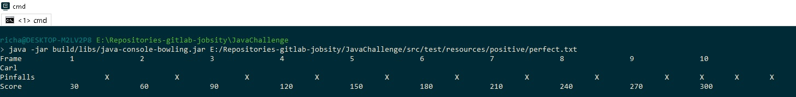
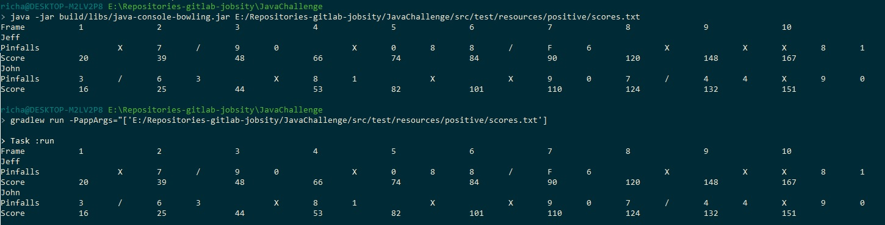
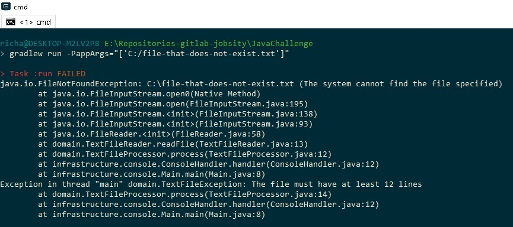
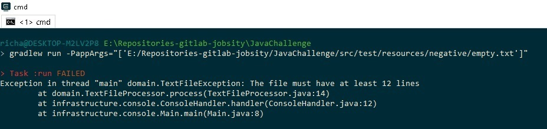
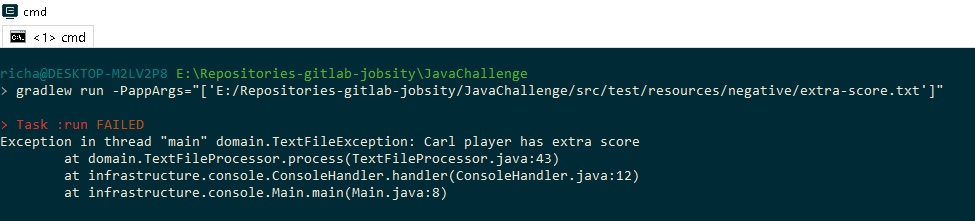
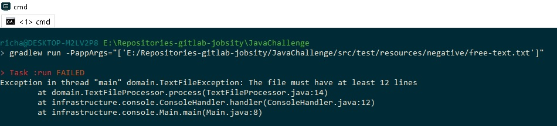
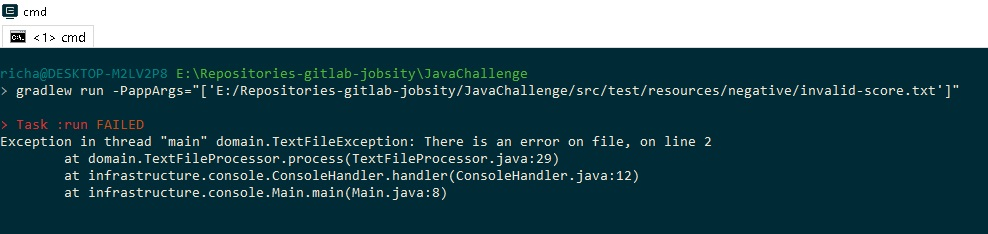
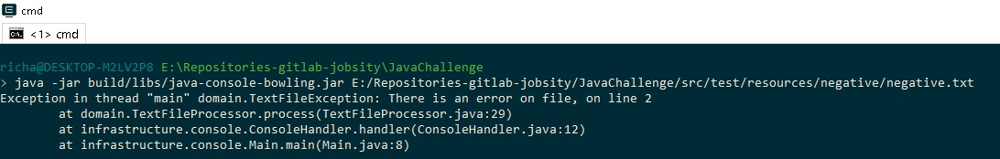
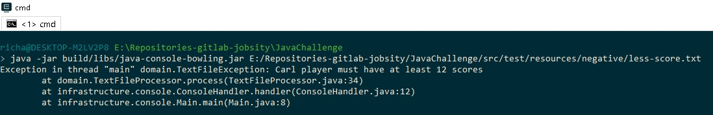

# Java Challenge

Bowling scores.

## Pre requirements 🔧
1. Install java version "1.8.0_291".

## Deploy (With jar file) 🚀
1. Clone Repository: `git clone https://git.jobsity.com/RichardSeverich/JavaChallenge.git`
2. Generate JAR file: `gradlew build`
3. Run app: `java -jar build/libs/java-console-bowling.jar filePath`
   Run app example: `java -jar build/libs/java-console-bowling.jar E:/Repositories-gitlab-jobsity/JavaChallenge/src/test/resources/positive/scores.txt`
   Run app example: `java -jar build/libs/java-console-bowling.jar E:/Repositories-gitlab-jobsity/JavaChallenge/src/test/resources/positive/perfect.txt`

## Deploy (Without jar file) 🚀
1. Clone Repository: `git clone https://git.jobsity.com/RichardSeverich/JavaChallenge.git`
2. Run app: `gradlew run -PappArgs="['filePath']"`
   Run app example: `gradlew run -PappArgs="['E:/Repositories-gitlab-jobsity/JavaChallenge/src/test/resources/positive/scores.txt']"`
   Run app example: `gradlew run -PappArgs="['E:/Repositories-gitlab-jobsity/JavaChallenge/src/test/resources/positive/perfect.txt']"`

## Run Tests 🔧
2. Run tests: `gradlew test`

## UI Demo

### Perfect Score

  

### Scores

  

### File that does not exist

  

### Empty file

  

### Extra score

  

### Free text

  

### Invalid score text

  

### Invalid score negative

  

### Missing score

  

