# java only with jsp

## Pre requisites

1. Windows 10 (64-bit).
2. Instalar Java version "1.8.0_291"
3. Instalar Eclipse 2021-06 (4.20.0)

## Deploy 🚀

1. Descomprimir el archivo "tomcat_8_5"

  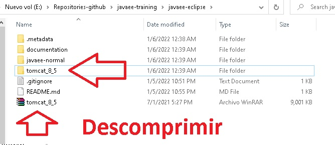

2. Abrir Eclipse y Seleccione la carpeta llamada "javaee-eclipse" 

  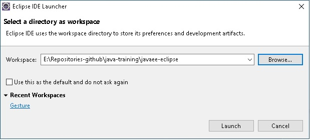

2. 1 Click en importar proyecto existente 

  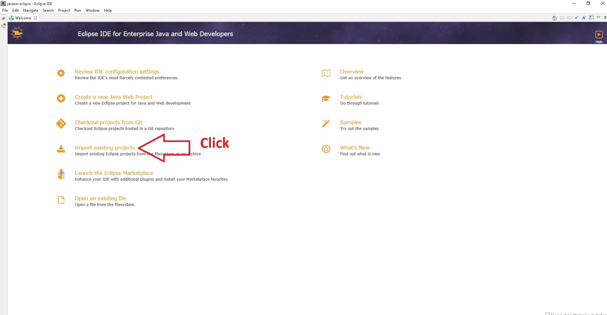

2. 2 Seleccionar su directorio y los proyectos como se ve en la siguiente imagen.

  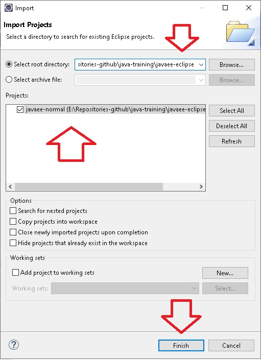

2. 3 ir a las propiedades del proyecto

  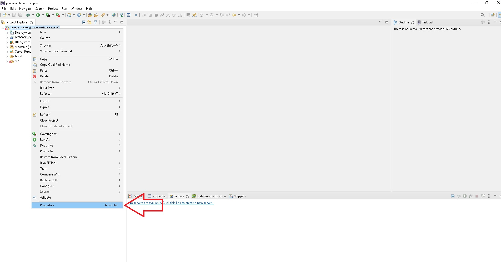

2. 4 Verificar que todo este como se muestra en la imagen

  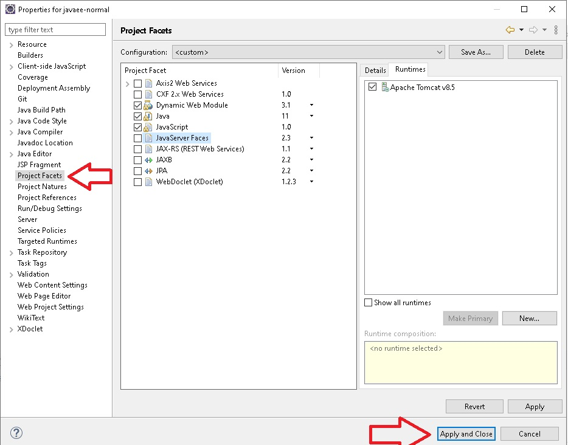

3. Añadir un servidor tomcat

  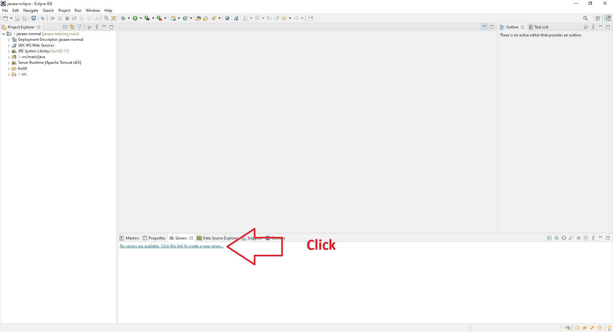

  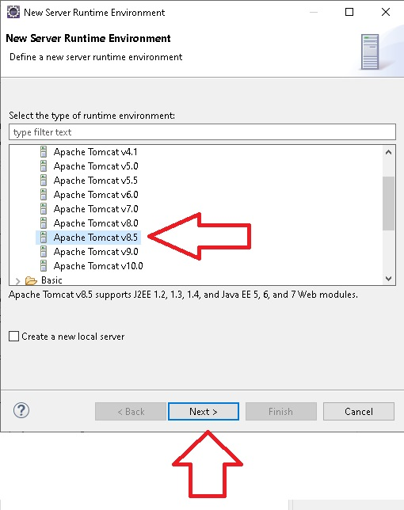

  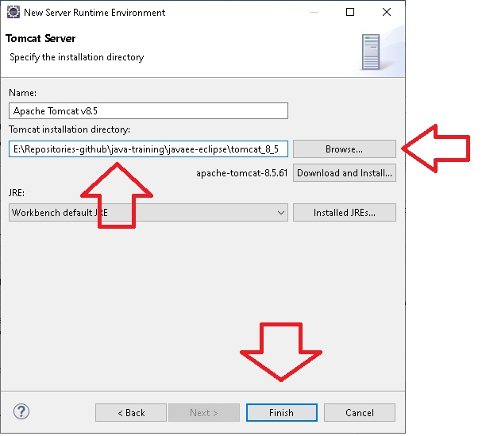

4. Añadir el proyecto al servidor tomcat

  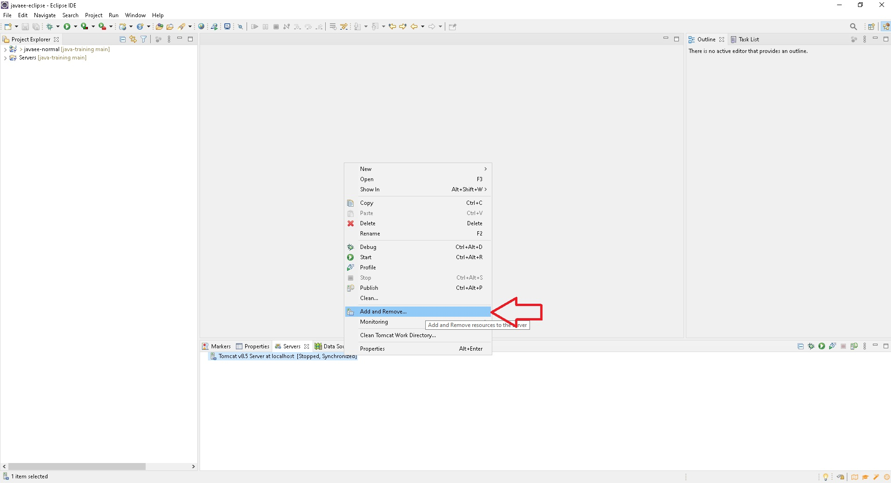

  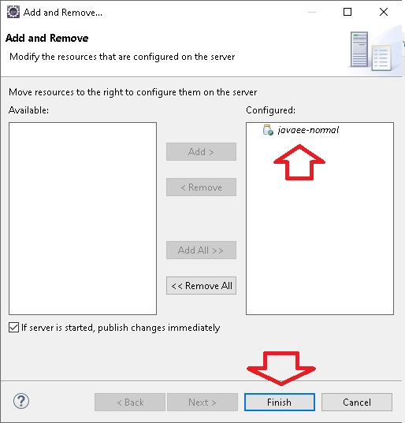

5. Iniciar la app

  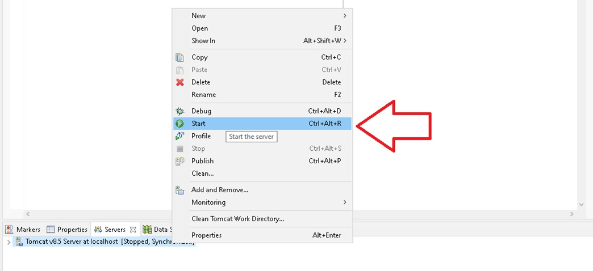

6. Ve al navegador e ingresa a: http://localhost:8080/javaee-normal/

## UI

  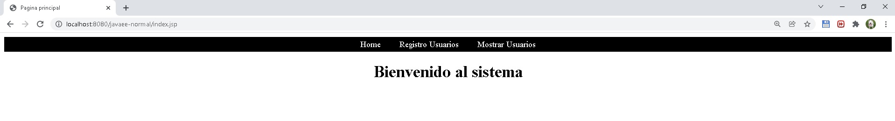

  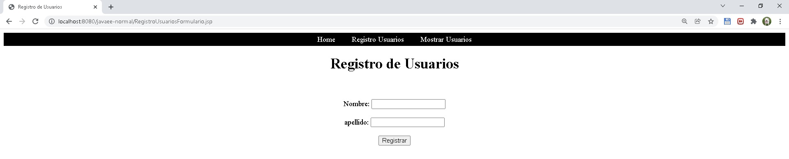

  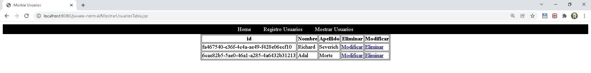

